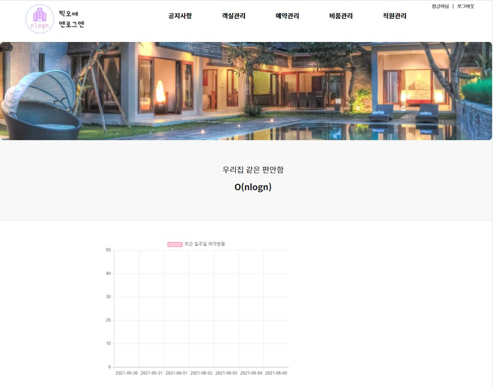
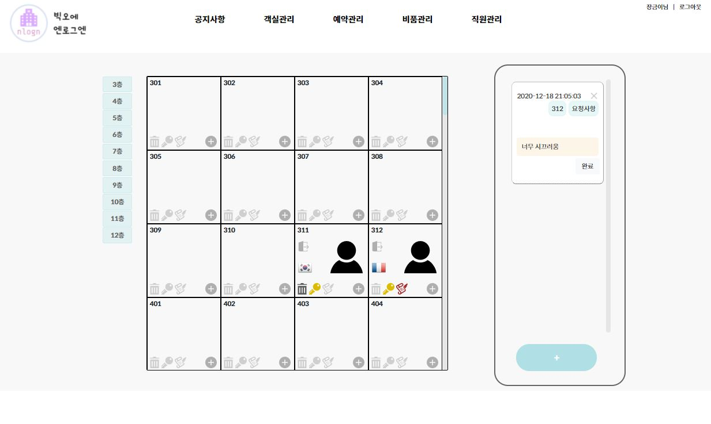
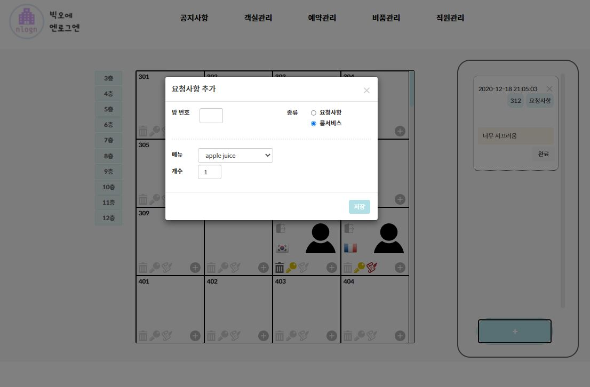
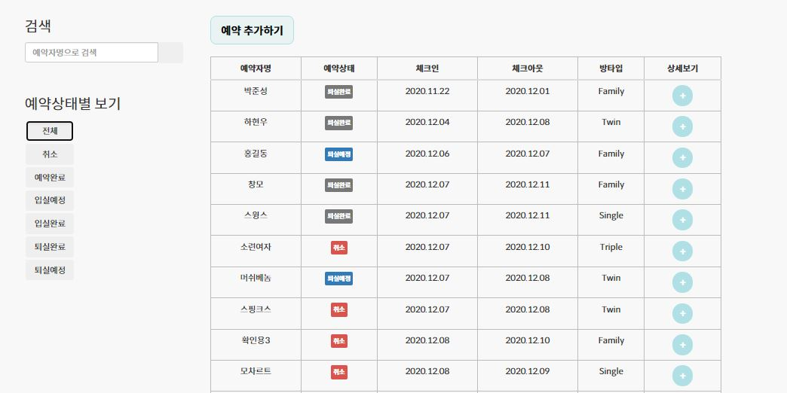
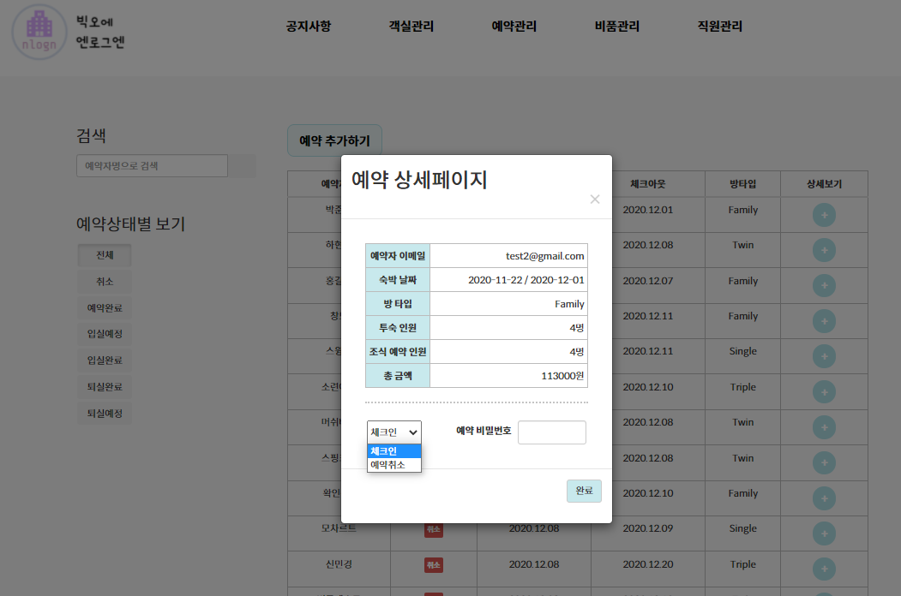
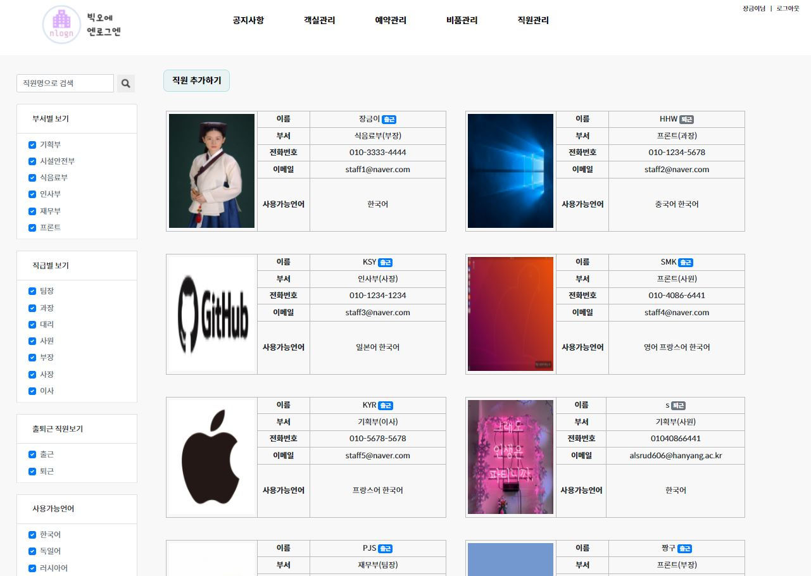
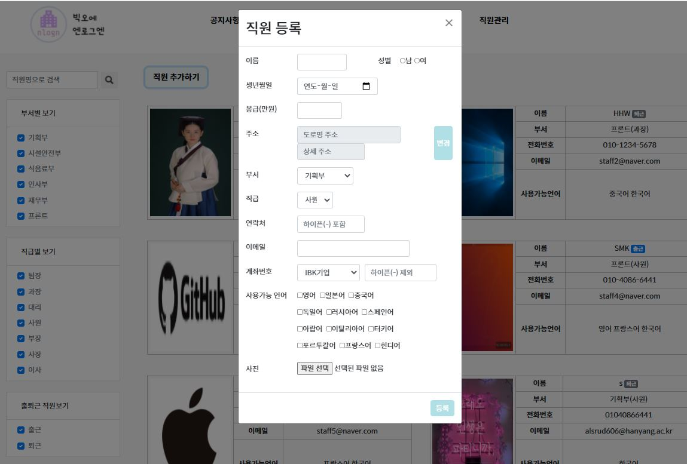
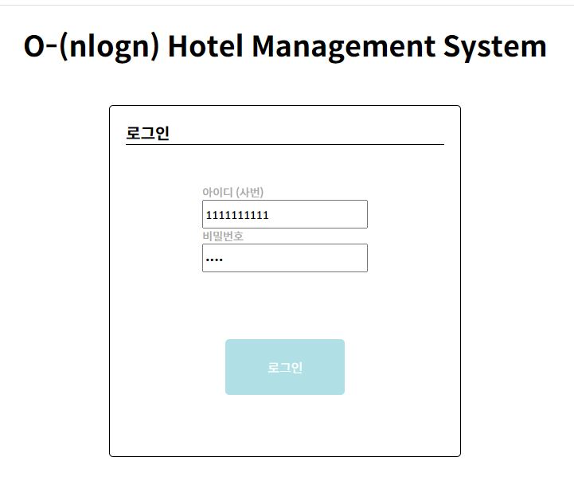

## **<center>2020-2 데이터베이스 호텔관리시스템 만들기</center>**

## Member
* 2019037129 소프트웨어학부 신민경
* 2019083436 소프트웨어학부 권유리
* 2017013390 응용수학학과 김성연
* 2019036844 소프트웨어학부 하현우
* 2019052851 소프트웨어학부 박준성
___
<br>

## Introduction
### **메인페이지**   
호텔 소개 및 사진이 있고 일주일 동안의 예약 현황을 그래프로 보여준다.
<p align="center"></p><br>

### **객실관리**  
객실별 고객 정보와 요청사항을 **실시간으로** 보여준다. 고객의 국적과 객실 청소 상태, 요청사항 여부를 아이콘으로 보여주며, 문 아이콘을 클릭하면 체크아웃을 할 수 있다. 양피지 아이콘 클릭시 최신 요청사항을 볼 수 있고 쓰레기통을 클릭하면 청소 상태를 바꿀 수 있다. +아이콘은 고객의 이름 및 조식 등의 예약 정보, 결제금액과 주의사항 등을 확인할 수 있다.  

왼쪽 파란색의 버튼을 클릭하여 원하는 층으로 이동이 가능하며 가장 오른쪽 테이블의 +아이콘을 클릭하면 룸서비스 및 요청사항을 추가할 수 있다. 가장 오래된 요청 순으로 정렬되며 완료 버튼을 누르면 테이블에서 삭제된다. 룸서비스 금액은 객실별 결제금액에 추가된다.

새로고침 없이 모든 정보가 업데이트 되기 때문에 여러 직원이 동시에 수정하는 것이 가능하다. 예를 들어 한 직원이 312호 객실을 체크아웃하면 객실관리 페이지를 보고 있던 다른 직원의 화면에서 312호의 사람 아이콘이 실시간으로 사라진다. 
<p align="center"></p><br>
<p align="center"></p><br>


### **예약관리**  
예약추가, 예약취소, 체크인을 관리하는 페이지다. 왼쪽 카테고리를 클릭하여 상태별로 예약을 관리할 수 있다. 체크인시에 객실관리 페이지에 실시간으로 반영이된다.
<p align="center"></p><br>
<p align="center"></p><br>


### **직원관리**
직원을 추가하고 정보를 확인할 수 있다. 각 직원의 출퇴근 상태, 가능 외국어를 확인할 수 있다. 객실에 직원을 배정할 때 직원의 출퇴근 상태, 사용 가능 외국어에 따라 적합한 객실에 우선적으로 배정한다.
<p align="center"></p><br>
<p align="center"></p><br>


<br><br>

## Install
1. 파일을 다운 받는다.
```bash
git clone git@github.com:O-nlogn/Hotel_Management_System.git
```
2. mysql에 데이터베이스를 만들고 hotel_system.sql을 복원한다.
```bash
mysql -u [계정이름] -p [만든 DB 이름] < [hotel_system.sql의 위치]
```
3. db.js 파일을 만들고 db-template.js의 내용을 수정하여 저장한다.
4. server.js 파일을 실행한다.
``` bash
   node server.js
```

<br><br>

## Guest로 로그인하기
아이디: 1111111111 / 비밀번호: 1234 입력
<p align="center"></p>


<br><br>

## 📢 커밋메시지 컨벤션
커밋메시지는 제목/본문/(issue number)로 구성한다.
```
type: subject

description

Issue: #1
```

### **type**
> - Feat: 기능 추가
> - Fix: 버그 수정
> - Docs: 문서 수정
> - Style: 코드 스타일(공백, 주석 등) 수정, 코드 변경 없는 경우
> - Refactor: 코드에 직접적인 변경이 있는 경우(변수명, 함수명 변경, 코드 구조 변경)
> - Test: 테스트 코드
> - type의 첫 글자는 모두 대문자로 쓴다.


### **subject**
> - type 콜론(:)과 subject 사이에는 공백을 한 칸씩 추가한다.
> - 수정 내용을 간략히 포함해야한다.
>   ```
>   ex) 버그 수정 (x), 한글이 깨지는 버그 수정(O)
>   ```
> - 50자 이내로 작성한다.


### **description**
> - 제목과 본문 사이는 한 줄 비운다.
> - 본문은 커밋의 이유와 수정된 사항을 자세하게 쓴다.
> - 이슈와 관련된 커밋인 경우 본문 가장 마지막 줄에 이슈 번호를 추가한다.

<br><br>

## 📢 코딩 컨벤션
> 1. 괄호의 방식은 K&R 스타일을 사용하도록 한다.
```java
void f(){ // O
    // this is k&r style
}

void f2() // X
{

}
```

> 2. 함수, 폴더, 변수명에 의미를 완전히 포함하도록 한다.
 (단, id, pw, cnt, tmp, str, pos, img, docs, src는 제외한다)
>
>3. 변수명은 카멜 표기법을 따르도록 한다.
>
>4. 주석은 한글로 작성하고, 기능별로 작성하도록 한다.
>
>5. 주석과 다음에 오는 코드 사이에 공백 한 줄을 포함하도록 한다.
(기능에 대한 주석은 해당 기능을 갖는 함수나 코드 윗줄에 작성하고 코드가 무엇을 의미하는 지에 대한 주석은 해당 코드와 같은 줄에 작성한다.)
>
>6. 여러 줄의 주석을 달 때는 /* */를 이용한다. (한 줄씩, 주석 처리를 하지 않는다.)
>
>7. 변수 할당 시는 '='를 포함하는 연산자를 기준으로 양 옆 공백을 하나씩 넣는다.
>
>8. 반복문과 다음에 오는 코드 사이에 공백 한 줄을 포함하도록 한다.
>
>9. goto, switch-case문은 사용하지 않도록 한다.
>
>10. for, if 다음에 오는 괄호는 띄우도록 한다.
```java
for (int i=0; i<10; i++){
    if (i == 5) break;
}
